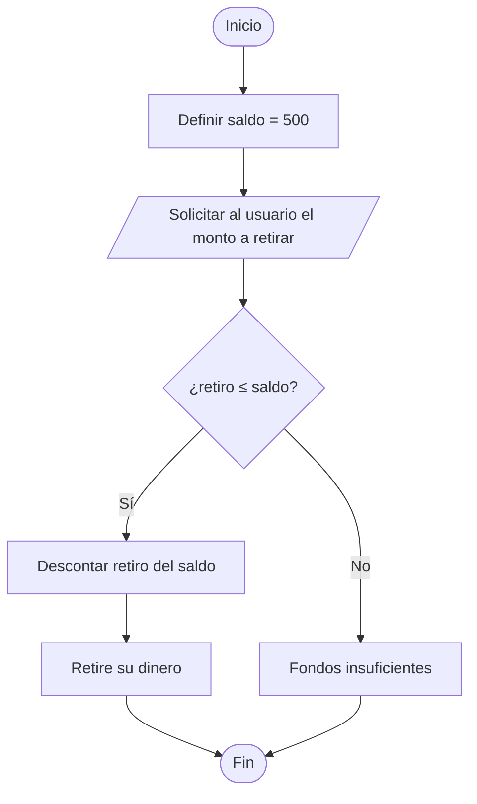

# Pseudocódigo: 
```pseudocode
Proceso CajeroAutomatico
    // Declaración de variables
    Definir saldo, retiro Como Real;

    // Asignación de saldo inicial
    saldo <- 500;

    // Solicitar la entrada del usuario
    Escribir "Bienvenido. Su saldo actual es: ", saldo;
    Escribir "Por favor, ingrese el monto que desea retirar:";
    Leer retiro;

    // Estructura de decisión: verifica si hay fondos suficientes
    Si retiro <= saldo Entonces
        // Acciones si el saldo es suficiente
        saldo <- saldo - retiro;
        Escribir "Retire su dinero";
        Escribir "Su nuevo saldo es: ", saldo;
    SiNo
        // Acciones si el saldo es insuficiente
        Escribir "Fondos insuficientes";
    FinSi

    Escribir "Gracias por su visita.";

FinProceso
```

# Código Mermaind: 



